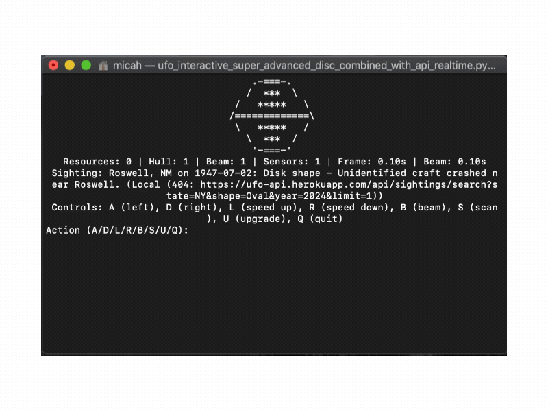

# 🛸 ufo-program

### 🎥 Latest Demo Video


*(New boot sequence + full interactive simulation)*

---

**Old-school CLI UFO Sentinel Frequency Simulator**

Middle school vibes — hacking CMD on locked computers 😂  
Peaceful retro terminal tool with Sentinel scanning, Lightning Bug Cloak, God’s Radar & No Harm Near protocol.

### 🚀 Quick Start (Copy & Paste)

```bash
git clone https://github.com/007tofreedom/ufo-program.git
cd ufo-program
pip install -r requirements.txt
python3 main.py

### 1. Clone the repo

```bash
git clone https://github.com/007tofreedom/ufo-program.git
cd ufo-program
2. Install dependencies
Bash pip install -r requirements.txt
3. Run the program
Bash python main.py
Note for Mac users: If python doesn't work, try:
Bash python3 main.py
